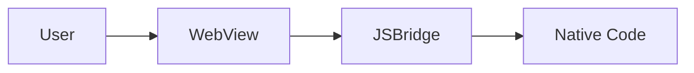

# ComposeWebView Documentation Management

This skill manages the MkDocs documentation site and API references for ComposeWebView.

## Quick Commands

### Serve Documentation Locally
```bash
bash .agent/skills/documentation/scripts/mkdocs_serve.sh
```

Opens documentation at http://127.0.0.1:8000

### Build Documentation
```bash
bash .agent/skills/documentation/scripts/mkdocs_build.sh
```

Builds static site to `site/` directory.

### Validate Documentation
```bash
bash .agent/skills/documentation/scripts/validate_docs.sh
```

Checks for broken links and missing files.

## Documentation Structure

Current MkDocs site structure (defined in `mkdocs.yml`):

```
docs/
├── index.md                    # Home page
├── getting-started.md          # Installation and setup
├── guides/
│   ├── state-management.md    # WebViewState guide
│   ├── js-bridge.md           # JSBridge guide
│   ├── lifecycle.md           # Lifecycle management
│   ├── errors.md              # Error handling
│   └── features.md            # Advanced features
└── api/
    ├── compose-webview.md     # Main API reference
    └── types.md               # Types reference
```

See [reference/mkdocs_structure.md](reference/mkdocs_structure.md) for complete navigation structure.

## Adding New Content

### Creating a Guide

1. **Create file** in `docs/guides/your-guide.md`
2. **Use template**: [templates/guide_template.md](templates/guide_template.md)
3. **Add to navigation** in `mkdocs.yml`:
   ```yaml
   nav:
     - Guides:
       - Your Guide: guides/your-guide.md
   ```
4. **Validate**: `bash .agent/skills/documentation/scripts/validate_docs.sh`
5. **Preview**: `mkdocs serve`

### Creating API Documentation

1. **Add KDoc** to public APIs (REQUIRED)
   ```kotlin
   /**
    * Brief description.
    *
    * @param param Description
    * @return Description
    */
   fun yourFunction(param: String): String
   ```

2. **Create file** in `docs/api/your-api.md`
3. **Use template**: [templates/api_doc_template.md](templates/api_doc_template.md)
4. **Include code examples** with syntax highlighting
5. **Add to navigation** in `mkdocs.yml`

### Updating Existing Docs

1. **Edit** the `.md` file in `docs/`
2. **Preview changes**: `mkdocs serve`
3. **Validate**: `bash .agent/skills/documentation/scripts/validate_docs.sh`
4. **Build**: `bash .agent/skills/documentation/scripts/mkdocs_build.sh`

## Documentation Standards

### Writing Guidelines

- **Clear and concise**: Use simple language
- **Code examples**: Provide working, copy-pasteable code
- **Internal links**: Use relative paths (`[link](../other-page.md)`)
- **Platform notes**: Use admonitions for platform-specific info

See [reference/documentation_standards.md](reference/documentation_standards.md) for complete style guide.

### Code Blocks

Use triple backticks with language identifier:

````markdown
```kotlin
fun example() {
    println("Hello, World!")
}
```
````

Supported languages: `kotlin`, `bash`, `yaml`, `json`, `xml`, `gradle`

### Admonitions

Use for important notes:

```markdown
!!! note "Optional Title"
    Content here

!!! warning
    Warning content

!!! tip
    Helpful tip

!!! example
    Example content
```

### Mermaid Diagrams

MkDocs supports Mermaid for diagrams:

````markdown

````

## MkDocs Configuration

Current configuration in `mkdocs.yml`:

- **Theme**: Material
- **Features**: Navigation tabs, search, code copy, tabbed content
- **Extensions**: Syntax highlighting, superfences, admonitions, emoji

See full configuration in project root `mkdocs.yml`.

## Deployment

Documentation auto-deploys on push to `main` via GitHub Actions (`.github/workflows/docs.yml`).

**Published URL**: https://parkwoocheol.github.io/compose-webview/

## Scripts

### mkdocs_serve.sh
Serves documentation locally with error handling. Checks if MkDocs is installed.

### mkdocs_build.sh
Builds documentation with `--strict` mode. Cleans previous build before starting.

### validate_docs.sh
Validates documentation structure:
- Checks required files exist
- Validates internal links (basic)
- Reports missing files

### generate_api_docs.sh
Guide for generating API documentation. Currently uses manual docs; can be extended with Dokka integration.

## Dependencies

Required:
- **Python 3.x**
- **MkDocs Material**: `pip install mkdocs-material`

Verify installation:
```bash
python3 --version
mkdocs --version
```

See [DEPENDENCIES.md](../DEPENDENCIES.md) for installation instructions.

## Common Tasks

### Local Preview
```bash
bash .agent/skills/documentation/scripts/mkdocs_serve.sh
```

### Build for Production
```bash
bash .agent/skills/documentation/scripts/mkdocs_build.sh
```

### Add New Page
1. Create `.md` file in `docs/`
2. Add to `mkdocs.yml` navigation
3. Preview with `mkdocs serve`

### Fix Broken Build
1. Check `mkdocs_build.sh` output for errors
2. Fix markdown syntax errors
3. Verify all links are valid
4. Rebuild

## Troubleshooting

### MkDocs Not Found
```bash
pip install mkdocs-material
```

### Build Fails
- Check markdown syntax
- Verify all linked files exist
- Check `mkdocs.yml` for syntax errors

### Links Not Working
- Use relative paths from file location
- Don't include `.md` extension in links when using navigation

## Related Resources

- **MkDocs Documentation**: https://www.mkdocs.org/
- **Material Theme**: https://squidfunk.github.io/mkdocs-material/
- **Project Knowledge**: `.agent/knowledge/`
