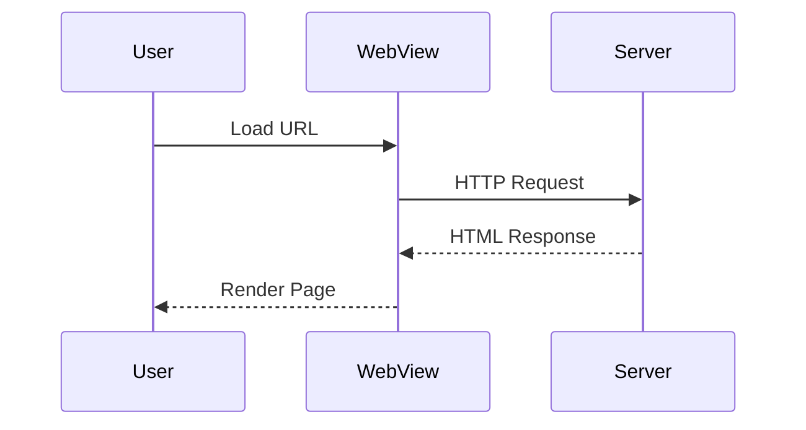

# Documentation Standards

Writing style guide and best practices for ComposeWebView documentation.

## General Principles

### 1. Clarity First
- Use simple, clear language
- Avoid jargon unless necessary
- Define technical terms when first used
- Write for developers of varying experience levels

### 2. Show, Don't Just Tell
- Include working code examples
- Provide complete, copy-pasteable snippets
- Show both basic and advanced usage

### 3. Keep It Current
- Update docs when code changes
- Mark deprecated features
- Include version information when relevant

## Writing Style

### Tone
- **Professional yet friendly**
- **Direct and concise**
- **Helpful and encouraging**

### Voice
- **Active voice** preferred over passive
  - ✅ "Call this method to..."
  - ❌ "This method should be called to..."

- **Second person** for instructions
  - ✅ "You can configure..."
  - ❌ "One can configure..." or "Users can configure..."

### Tense
- **Present tense** for describing behavior
  - ✅ "The WebView loads the URL"
  - ❌ "The WebView will load the URL"

## Document Structure

### Page Template

```markdown
# Page Title

Brief introduction explaining what this page covers (2-3 sentences).

## Prerequisites

- Requirement 1
- Requirement 2

## Main Content

### Section 1

Content with code examples.

### Section 2

More content.

## Common Issues

### Issue 1

Description and solution.

## Next Steps

- [Related Topic](link)
- [Another Topic](link)
```

### Headings

- **One H1** per page (page title)
- **H2** for main sections
- **H3** for subsections
- **Avoid** H4+ (reorganize if needed)

## Code Examples

### General Rules

1. **Complete and runnable**: Code should work as-is
2. **Syntax highlighted**: Always specify language
3. **Commented when complex**: Explain non-obvious parts
4. **Realistic**: Use real-world scenarios

### Kotlin Code

````markdown
```kotlin
@Composable
fun WebViewExample() {
    val state = rememberWebViewState(
        initialUrl = "https://example.com"
    )

    ComposeWebView(
        state = state,
        modifier = Modifier.fillMaxSize()
    )
}
```
````

### Best Practices

- **Show imports** when not obvious:
  ```kotlin
  import com.parkwoocheol.composewebview.ComposeWebView
  import androidx.compose.runtime.Composable
  ```

- **Include full context** for clarity:
  ```kotlin
  // Bad: Fragment without context
  state.loadUrl("https://example.com")

  // Good: Complete example
  val controller = rememberWebViewController(state)

  LaunchedEffect(Unit) {
      controller.loadUrl("https://example.com")
  }
  ```

- **Use realistic names**:
  - ✅ `userProfileUrl`, `articleWebView`
  - ❌ `foo`, `bar`, `myVar`

## Links

### Internal Links

Use relative paths from current file:

```markdown
See [State Management](../guides/state-management.md) for details.
```

### External Links

Include descriptive text:

```markdown
See [Kotlin documentation](https://kotlinlang.org/docs/) for more information.
```

### API References

Link to specific sections when possible:

```markdown
The [ComposeWebView](../api/compose-webview.md#composewebview) composable...
```

## Formatting

### Inline Code

Use backticks for:
- Function names: `rememberWebViewState()`
- Class names: `WebViewState`
- Parameters: `initialUrl`
- Short code snippets: `state.loadingState`

### Bold

Use for:
- **Emphasis** on important points
- **UI elements**: Click the **Save** button
- **Not** for headings (use # instead)

### Italic

Use sparingly for:
- *Terminology* when introducing terms
- *Notes* in special cases

### Lists

**Ordered lists** for sequential steps:
1. First step
2. Second step
3. Third step

**Unordered lists** for non-sequential items:
- Feature A
- Feature B
- Feature C

## Admonitions

Use Material for MkDocs admonitions for important information:

### Note

```markdown
!!! note
    Additional information that enhances understanding.
```

### Tip

```markdown
!!! tip "Pro Tip"
    Helpful advice or shortcut.
```

### Warning

```markdown
!!! warning
    Important caution or gotcha.
```

### Example

```markdown
!!! example "Complete Example"
    Full working code example.
```

### Platform-Specific

```markdown
!!! info "Android Only"
    This feature is only available on Android.
```

## Code Annotations

### Comments in Code

```kotlin
// Brief comment explaining the next line
val state = rememberWebViewState()

/*
 * Multi-line comment for complex logic.
 * Explain the why, not the what.
 */
fun complexOperation() {
    // ...
}
```

### KDoc in Documentation

Show KDoc format when documenting APIs:

```kotlin
/**
 * Loads a URL in the WebView.
 *
 * @param url The URL to load
 * @param headers Optional HTTP headers
 * @throws IllegalStateException if WebView is not initialized
 */
fun loadUrl(url: String, headers: Map<String, String> = emptyMap())
```

## Platform-Specific Content

### Indicating Platform Differences

Use admonitions:

```markdown
!!! info "Platform Differences"
    **Android**: Uses `android.webkit.WebView`
    **iOS**: Uses `WKWebView` with limited zoom control
    **Desktop**: Uses CEF (Chromium Embedded Framework)
```

### Tabbed Content

For platform-specific code:

````markdown
=== "Android"
    ```kotlin
    // Android-specific code
    ```

=== "iOS"
    ```kotlin
    // iOS-specific code
    ```
````

## Tables

Use for structured comparisons:

```markdown
| Feature | Android | iOS | Desktop | Web |
|---------|---------|-----|---------|-----|
| JSBridge | ✅ | ✅ | ✅ | ✅ |
| File Access | ✅ | ⚠️ Limited | ✅ | ❌ |
| DevTools | ✅ | ✅ | ✅ | ❌ |
```

## Diagrams

### Mermaid Support

Use Mermaid for architecture and flow diagrams:

````markdown

````

### Types of Diagrams

- **Sequence diagrams**: Show interaction flows
- **Flow charts**: Show decision trees
- **Class diagrams**: Show structure

## Common Sections

### Prerequisites

List what readers need before following the guide:

```markdown
## Prerequisites

- ComposeWebView 1.0.0 or later
- Android API 24+ or iOS 14.0+
- Basic knowledge of Jetpack Compose
```

### Installation

```markdown
## Installation

Add to your `build.gradle.kts`:

```kotlin
dependencies {
    implementation("com.github.parkwoocheol:compose-webview:1.0.0")
}
```
````

### Quick Start

Provide minimal working example:

```markdown
## Quick Start

```kotlin
@Composable
fun MinimalWebView() {
    ComposeWebView(
        state = rememberWebViewState("https://example.com")
    )
}
```
````

### API Reference

Document functions/classes systematically:

```markdown
### `rememberWebViewState()`

Creates and remembers a WebViewState.

**Parameters**:
- `initialUrl: String` - Initial URL to load
- `additionalHttpHeaders: Map<String, String>` - Optional headers

**Returns**: `WebViewState` - Remembered state instance

**Example**:
```kotlin
val state = rememberWebViewState(
    initialUrl = "https://example.com",
    additionalHttpHeaders = mapOf("Custom-Header" to "Value")
)
```
```

## Versioning

### Version Badges

Indicate version requirements:

```markdown
!!! note "Added in v1.2.0"
    This feature is available starting from version 1.2.0.
```

### Deprecation

Mark deprecated features clearly:

```markdown
!!! warning "Deprecated"
    This method is deprecated. Use `newMethod()` instead.
```

## Accessibility

- **Alt text** for images: ``
- **Descriptive links**: Avoid "click here"
- **Clear headings**: Logical hierarchy

## Quality Checklist

Before publishing documentation:

- [ ] Spell-checked
- [ ] Grammar-checked
- [ ] All code examples tested
- [ ] Links verified
- [ ] Platform differences noted
- [ ] Examples are complete and runnable
- [ ] Screenshots are current
- [ ] Build passes: `mkdocs build --strict`

## Common Mistakes to Avoid

### ❌ Don't

- Don't use future tense ("will load" → use "loads")
- Don't use passive voice unnecessarily
- Don't include incomplete code examples
- Don't assume reader knowledge without prerequisites
- Don't use ambiguous pronouns (it, this, that)

### ✅ Do

- Use present tense and active voice
- Provide complete, working examples
- List prerequisites clearly
- Be specific and concrete
- Test all code examples

---

Last updated: 2025-12-28
