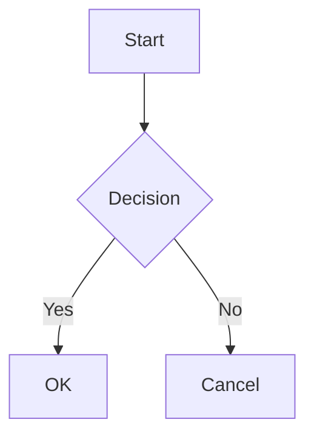

# MkDocs Site Structure

Complete reference for the ComposeWebView MkDocs documentation structure.

## Configuration File

**Location**: `mkdocs.yml` (project root)

## Site Metadata

```yaml
site_name: ComposeWebView
site_url: https://parkwoocheol.github.io/compose-webview/
repo_url: https://github.com/parkwoocheol/compose-webview
repo_name: parkwoocheol/compose-webview
```

## Theme Configuration

**Theme**: Material for MkDocs

### Color Scheme

- **Light mode**: Default scheme, indigo primary, deep purple accent
- **Dark mode**: Slate scheme, indigo primary, deep purple accent
- **Toggle**: User can switch between light and dark modes

### Features

- `navigation.tabs` - Top-level navigation tabs
- `navigation.sections` - Section-based navigation
- `navigation.top` - Back to top button
- `navigation.indexes` - Section index pages
- `search.suggest` - Search suggestions
- `search.highlight` - Highlight search results
- `content.code.copy` - Copy button for code blocks
- `content.tabs.link` - Linked content tabs

## Markdown Extensions

### Code Highlighting

```yaml
pymdownx.highlight:
  anchor_linenums: true
  line_spans: __span
  pygments_lang_class: true
```

Provides syntax highlighting with line numbers.

### Superfences

```yaml
pymdownx.superfences:
  custom_fences:
    - name: mermaid
      class: mermaid
      format: !!python/name:pymdownx.superfences.fence_code_format
```

Enables code blocks with custom formatting and Mermaid diagram support.

### Other Extensions

- `pymdownx.inlinehilite` - Inline code highlighting
- `pymdownx.snippets` - Include external file snippets
- `pymdownx.tabbed` - Tabbed content blocks
- `admonition` - Note/warning/tip callouts
- `pymdownx.details` - Collapsible sections
- `attr_list` - HTML attributes in markdown
- `md_in_html` - Markdown inside HTML tags
- `toc` - Table of contents with permalinks
- `pymdownx.emoji` - Emoji support

## Navigation Structure

```yaml
nav:
  - Home: index.md
  - Getting Started: getting-started.md
  - Guides:
    - State Management: guides/state-management.md
    - JS Bridge: guides/js-bridge.md
    - Lifecycle: guides/lifecycle.md
    - Error Handling: guides/errors.md
    - Advanced Features: guides/features.md
  - API Reference:
    - ComposeWebView: api/compose-webview.md
    - Types: api/types.md
```

## File Structure

```
docs/
├── index.md                      # Home page
├── getting-started.md            # Quick start guide
│
├── guides/                       # User guides
│   ├── state-management.md      # WebViewState and controller
│   ├── js-bridge.md             # JavaScript bridge integration
│   ├── lifecycle.md             # Lifecycle management
│   ├── errors.md                # Error handling patterns
│   └── features.md              # Advanced features
│
└── api/                         # API reference
    ├── compose-webview.md       # Main Composable and controllers
    └── types.md                 # Data types and enums
```

## Adding New Pages

### To Navigation

Edit `mkdocs.yml` and add to the `nav` section:

```yaml
nav:
  - Existing Section:
    - New Page: path/to/new-page.md
```

### New Section

```yaml
nav:
  - New Section:
    - Page 1: section/page1.md
    - Page 2: section/page2.md
```

## URL Structure

MkDocs generates clean URLs:

- `docs/index.md` → `/`
- `docs/getting-started.md` → `/getting-started/`
- `docs/guides/state-management.md` → `/guides/state-management/`

## Assets

### Images

Place in `docs/` directory:

```markdown

```

### Custom CSS

Can be added in `mkdocs.yml`:

```yaml
extra_css:
  - stylesheets/extra.css
```

### Custom JavaScript

```yaml
extra_javascript:
  - javascripts/extra.js
```

## Search

Enabled by default with Material theme.

Features:
- **Fuzzy search** - Tolerates typos
- **Suggestions** - Shows suggestions as you type
- **Highlighting** - Highlights search terms in results

## Deployment

### GitHub Pages

Configured in `.github/workflows/docs.yml`:

1. Triggers on push to `main`
2. Builds documentation with MkDocs
3. Deploys to `gh-pages` branch
4. Published at: https://parkwoocheol.github.io/compose-webview/

### Manual Deployment

```bash
# Build and deploy
mkdocs gh-deploy

# Build only
mkdocs build

# Serve locally
mkdocs serve
```

## Build Output

Builds to `site/` directory:

```
site/
├── index.html
├── getting-started/
│   └── index.html
├── guides/
│   ├── state-management/
│   │   └── index.html
│   └── ...
├── api/
│   └── ...
├── assets/
│   ├── stylesheets/
│   └── javascripts/
└── search/
    └── search_index.json
```

## Content Guidelines

### Page Structure

Each page should have:

1. **Title** (# heading)
2. **Introduction** - Brief overview
3. **Sections** (## headings)
4. **Code examples** - Illustrate concepts
5. **Next steps** - Links to related pages

### Cross-References

Use relative links:

```markdown
See [State Management](../guides/state-management.md) for details.
```

### Code Blocks

Always specify language:

````markdown
```kotlin
fun example() {
    println("Hello")
}
```
````

## Special Pages

### Home (index.md)

Should include:
- Project overview
- Key features
- Quick start
- Links to main sections

### Getting Started

Should include:
- Installation instructions
- Basic setup
- First example
- Next steps

## Advanced Features

### Tabbed Content

```markdown
=== "Kotlin"
    ```kotlin
    val example = "Kotlin"
    ```

=== "Java"
    ```java
    String example = "Java";
    ```
```

### Collapsible Sections

```markdown
??? note "Optional Title"
    This content is collapsed by default.

???+ note "Expanded by Default"
    This content starts expanded.
```

### Mermaid Diagrams

````markdown

````

## Maintenance

### Regular Tasks

1. **Check broken links** - Use validate script
2. **Update screenshots** - Keep visuals current
3. **Review outdated content** - Update for new versions
4. **Test builds** - Ensure no build errors

### Version Updates

When updating MkDocs or theme:

```bash
pip install --upgrade mkdocs-material
```

Then test build:

```bash
mkdocs build --strict
```

## Troubleshooting

### Build Errors

- **Broken links**: Check file paths in markdown
- **YAML syntax**: Validate `mkdocs.yml`
- **Missing files**: Ensure all referenced files exist

### Navigation Issues

- **Page not appearing**: Add to `nav` in `mkdocs.yml`
- **Wrong order**: Adjust order in `nav` section

---

Last updated: 2025-12-28
